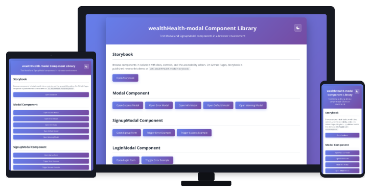

<h1 align="center">WealthHealth-modal</h1>

[](https://www.npmjs.com/package/@steinshy/wealthhealth-modal)
[](https://www.npmjs.com/package/@steinshy/wealthhealth-modal)
[](./LICENSE)
[](https://www.typescriptlang.org)
[](https://react.dev)
[](https://www.w3.org/WAI/WCAG21/quickref/)
[](https://vitejs.dev)
[](https://storybook.js.org)
[](https://eslint.org)
[](https://prettier.io)
[](https://stylelint.io)

<div align="center">
  
</div>

Bibliothèque React légère de modales basée sur l’élément natif `<dialog>`. Inclut des modales prêtes à l’emploi (SignupModal, LoginModal, ConfirmModal) avec validation de formulaire et accessibilité intégrées.

## Démo en ligne et Storybook

| Ressource      | URL ou lien                                                 |
| -------------- | ----------------------------------------------------------- |
| Langue         | Français · [English](./README.md)                           |
| Architecture   | [ARCHITECTURE.md](./ARCHITECTURE.md)                        |
| ArchitectureFr | [ARCHITECTURE.fr.md](./ARCHITECTURE.fr.md)                  |
| GitHub         | https://github.com/Steinshy/OC-WealthHealth-modal           |
| Démo           | https://steinshy.github.io/OC-WealthHealth-modal/           |
| Storybook      | https://steinshy.github.io/OC-WealthHealth-modal/storybook/ |
| Npm Package    | https://www.npmjs.com/package/@steinshy/wealthhealth-modal  |

Sur GitHub Pages, la démo et Storybook sont produites dans une même étape CI : la démo est à la racine du site et Storybook est publié sous `storybook/`.

## Fonctionnalités

- **Élément natif `<dialog>`** — Pas de piège à focus maison, uniquement l’API navigateur
- **Accessible WCAG 2.1 AA** — Libellés, messages d’erreur, gestion du focus
- **TypeScript d’abord** — Typage complet immédiatement utilisable
- **React 18 et 19** — Compatible avec les deux versions
- **CSS Modules** — Styles encapsulés, pas de collision de classes
- **Formulaires prêts à l’emploi** — SignupModal, LoginModal, ConfirmModal
- **Mode sombre et mouvement réduit** — Respect des préférences utilisateur
- **Hook `useTheme`** — Bascule clair/sombre avec persistance `localStorage`

## Prérequis

- **Node.js** 18 ou supérieur (la CI du dépôt utilise Node 22)
- **React** 18 ou 19

## Installation

```bash
npm install @steinshy/wealthhealth-modal
```

## Démarrage rapide

### Modale de base

```tsx
import { Modal } from '@steinshy/wealthhealth-modal';
import { useState } from 'react';

export function App() {
  const [isOpen, setIsOpen] = useState(false);

  return (
    <>
      <button onClick={() => setIsOpen(true)}>Open Modal</button>
      <Modal isOpen={isOpen} onClose={() => setIsOpen(false)} title="Welcome" status="success">
        <p>Operation completed successfully!</p>
      </Modal>
    </>
  );
}
```

### Formulaire d’inscription

```tsx
import { SignupModal, type SignupFormData } from '@steinshy/wealthhealth-modal';
import { useState } from 'react';

export function AuthPage() {
  const [isOpen, setIsOpen] = useState(false);
  const [error, setError] = useState<string>();

  const handleSignup = async (data: SignupFormData) => {
    try {
      await fetch('/api/auth/signup', {
        method: 'POST',
        body: JSON.stringify(data),
      });
      // Modal auto-closes on success
    } catch (err) {
      setError('Signup failed');
    }
  };

  return (
    <>
      <button onClick={() => setIsOpen(true)}>Sign Up</button>
      <SignupModal isOpen={isOpen} onClose={() => setIsOpen(false)} onSubmit={handleSignup} error={error} />
    </>
  );
}
```

## Composants

### Modal

Modale de base. À utiliser pour du contenu personnalisé.

| Prop                | Type                                                       | Défaut      | Description                                          |
| ------------------- | ---------------------------------------------------------- | ----------- | ---------------------------------------------------- |
| `isOpen`            | `boolean`                                                  | obligatoire | Afficher / masquer                                   |
| `onClose`           | `() => void`                                               | obligatoire | Appelée une fois à la fermeture                      |
| `title`             | `string`                                                   | optionnel   | Titre (en-tête absent si non défini)                 |
| `children`          | `ReactNode`                                                | obligatoire | Contenu                                              |
| `status`            | `'success' \| 'error' \| 'info' \| 'warning' \| 'default'` | `'default'` | État visuel (bordure supérieure)                     |
| `size`              | `'sm' \| 'md' \| 'lg'`                                     | `'md'`      | Largeur                                              |
| `autoCloseDuration` | `number`                                                   | optionnel   | Fermeture automatique après N ms                     |
| `showCloseButton`   | `boolean`                                                  | `true`      | Bouton × (si `title` et `dismissible` le permettent) |
| `dismissible`       | `boolean`                                                  | `true`      | Autoriser Échap, fond (si activé) et bouton fermer   |
| `closeOnBackdrop`   | `boolean`                                                  | `true`      | Clic à l’extérieur pour fermer                       |
| `icon`              | `ReactNode`                                                | optionnel   | Icône d’en-tête                                      |
| `footer`            | `ReactNode`                                                | optionnel   | Pied de page sous le contenu                         |
| `className`         | `string`                                                   | optionnel   | Classe supplémentaire sur `<dialog>`                 |

### SignupModal

Formulaire d’inscription (e-mail, mot de passe, confirmation).

| Prop            | Type                                      | Défaut      | Description                                      |
| --------------- | ----------------------------------------- | ----------- | ------------------------------------------------ |
| `isOpen`        | `boolean`                                 | obligatoire | Afficher / masquer                               |
| `onClose`       | `() => void`                              | obligatoire | Callback à la fermeture                          |
| `onSubmit`      | `(data: SignupFormData) => Promise<void>` | obligatoire | Envoi async ; lever une exception en cas d’échec |
| `isLoading`     | `boolean`                                 | `false`     | Spinner et envoi désactivé                       |
| `error`         | `string`                                  | optionnel   | Bandeau d’erreur en haut                         |
| `initialData`   | `SignupFormData`                          | optionnel   | Champs préremplis                                |
| `showSuccess`   | `boolean`                                 | optionnel   | Afficher le succès sans soumettre (ex. démos)    |
| `initialErrors` | `Record<string, string>`                  | optionnel   | Erreurs par champ à l’ouverture                  |

### LoginModal

Formulaire de connexion (e-mail et mot de passe).

| Prop            | Type                                     | Défaut      | Description                                      |
| --------------- | ---------------------------------------- | ----------- | ------------------------------------------------ |
| `isOpen`        | `boolean`                                | obligatoire | Afficher / masquer                               |
| `onClose`       | `() => void`                             | obligatoire | Callback à la fermeture                          |
| `onSubmit`      | `(data: LoginFormData) => Promise<void>` | obligatoire | Envoi async ; lever une exception en cas d’échec |
| `isLoading`     | `boolean`                                | `false`     | Spinner et envoi désactivé                       |
| `error`         | `string`                                 | optionnel   | Bandeau d’erreur en haut                         |
| `initialData`   | `LoginFormData`                          | optionnel   | Champs préremplis                                |
| `showSuccess`   | `boolean`                                | optionnel   | Afficher le succès sans soumettre                |
| `initialErrors` | `Record<string, string>`                 | optionnel   | Erreurs par champ à l’ouverture                  |

### ConfirmModal

Boîte de dialogue de confirmation oui / non.

| Prop           | Type                                                       | Défaut      | Description                                              |
| -------------- | ---------------------------------------------------------- | ----------- | -------------------------------------------------------- |
| `isOpen`       | `boolean`                                                  | obligatoire | Afficher / masquer                                       |
| `onClose`      | `() => void`                                               | obligatoire | Callback à la fermeture                                  |
| `onConfirm`    | `() => void \| Promise<void>`                              | obligatoire | Confirmation — la modale se ferme à la fin du traitement |
| `title`        | `string`                                                   | obligatoire | Titre                                                    |
| `children`     | `ReactNode`                                                | obligatoire | Contenu                                                  |
| `confirmLabel` | `string`                                                   | `'Confirm'` | Libellé du bouton de confirmation                        |
| `cancelLabel`  | `string`                                                   | `'Cancel'`  | Libellé du bouton d’annulation                           |
| `isLoading`    | `boolean`                                                  | `false`     | Spinner, boutons désactivés                              |
| `status`       | `'success' \| 'error' \| 'info' \| 'warning' \| 'default'` | `'default'` | État visuel                                              |

## Thème

### `useTheme()`

Hook qui gère le mode clair / sombre : il pose `data-theme` sur `<html>`, enregistre le choix dans `localStorage` sous la clé **`wh-theme`**, et utilise `prefers-color-scheme` du système lors de la première visite.

```tsx
import { useTheme } from '@steinshy/wealthhealth-modal';

export function App() {
  const { theme, toggleTheme, setTheme, isDark } = useTheme();

  return (
    <>
      <button onClick={toggleTheme}>{isDark ? '☀ Light mode' : '☾ Dark mode'}</button>
      {/* All modals respond automatically */}
    </>
  );
}
```

| Valeur retournée | Type                 | Description                         |
| ---------------- | -------------------- | ----------------------------------- |
| `theme`          | `'light' \| 'dark'`  | Thème actif                         |
| `isDark`         | `boolean`            | `true` si le thème sombre est actif |
| `toggleTheme`    | `() => void`         | Basculer clair / sombre             |
| `setTheme`       | `(t: Theme) => void` | Forcer un thème                     |

Types exportés : `Theme`, `UseThemeReturn` (voir les exports du paquet).

Le hook écrit `data-theme="light"` ou `data-theme="dark"` sur `<html>`. Tous les composants de la bibliothèque s’y adaptent automatiquement — pas de `ThemeProvider` ni de props à enfiler.

> **SSR :** `useTheme` lit `localStorage` et `window.matchMedia` au montage ; le rendu côté serveur reste sûr (valeur par défaut `'light'` sur le serveur).

## Styles

Les composants utilisent des CSS Modules. Surcharge possible avec `className` :

```tsx
import { Modal } from '@steinshy/wealthhealth-modal';
import styles from './customStyles.module.css';

<Modal isOpen={true} onClose={() => {}} className={styles.custom}>
  Content
</Modal>;
```

Propriétés CSS personnalisables (exemples) :

```css
:root {
  --modal-bg: #ffffff;
  --modal-text: rgba(0, 0, 0, 0.87);
  --modal-text-light: rgba(0, 0, 0, 0.6);
  --modal-border-radius: 4px;
  --modal-shadow: 0 5px 5px -3px rgba(0, 0, 0, 0.2), 0 8px 10px 1px rgba(0, 0, 0, 0.14), 0 3px 14px 2px rgba(0, 0, 0, 0.12);
  --modal-border-color-success: #4caf50;
  --modal-border-color-error: #f44336;
  --modal-border-color-info: #2196f3;
  --modal-border-color-warning: #ff9800;
  --modal-title-color-success: #2e7d32;
  --modal-title-color-error: #c62828;
  --modal-title-color-info: #1565c0;
  --modal-title-color-warning: #e65100;
}
```

Surcharge du mode sombre via `data-theme` (posé par `useTheme`) ou la requête média :

```css
/* via le hook useTheme() */
[data-theme='dark'] {
  --modal-bg: #424242;
  --modal-text: rgba(255, 255, 255, 0.87);
}

/* ou préférence système */
@media (prefers-color-scheme: dark) {
  :root {
    --modal-bg: #424242;
    --modal-text: rgba(255, 255, 255, 0.87);
  }
}
```

## Accessibilité

- Élément natif `<dialog>` (sémantique correcte)
- Confinement du focus géré par le navigateur avec `showModal()`
- Touche Échap pour fermer
- Libellés explicites sur les champs
- Messages d’erreur reliés aux champs via `aria-describedby`
- Focus sur le premier champ en erreur
- Contraste des couleurs 4,5:1 (niveau AA)
- Respect de `prefers-reduced-motion` et `prefers-color-scheme`
- Taille de police minimale 16px sur les champs (évite le zoom iOS)

## Navigateurs pris en charge

| Navigateur | Version |
| ---------- | ------- |
| Chrome     | 37+     |
| Firefox    | 98+     |
| Safari     | 15.4+   |
| Edge       | 79+     |

## Développer ce dépôt

| Commande             | Description                                                                     |
| -------------------- | ------------------------------------------------------------------------------- |
| `npm run dev`        | Démo (http://localhost:5173) et Storybook (http://localhost:6006) ensemble      |
| `npm run dev:demo`   | Démo seule                                                                      |
| `npm run storybook`  | Storybook seul                                                                  |
| `npm run build`      | Build bibliothèque vers `dist/`                                                 |
| `npm run build:demo` | Démo + Storybook statique dans `dist-demo/` (même disposition que GitHub Pages) |
| `npm run preview`    | Servir `dist-demo` en local après `build:demo`                                  |

La CI exécute le formatage, ESLint, Stylelint, la vérification TypeScript et `build:demo` avec le chemin de base GitHub Pages, puis vérifie la présence de `dist-demo/storybook/index.html`.

Pour l’arborescence, les builds et les workflows : [ARCHITECTURE.fr.md](./ARCHITECTURE.fr.md) · [English](./ARCHITECTURE.md).

## Licence

MIT

---
